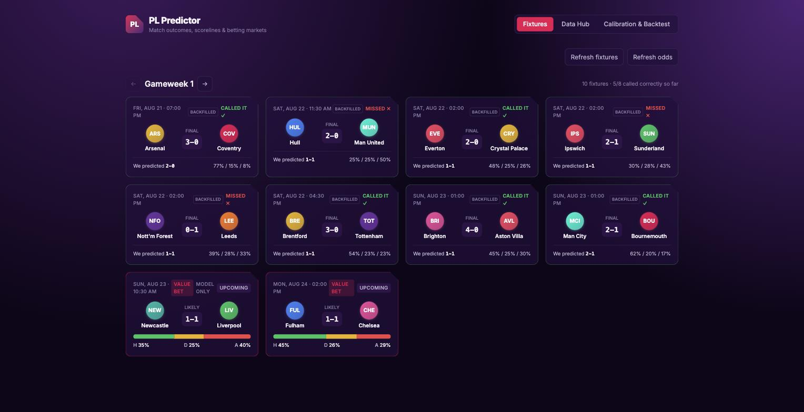
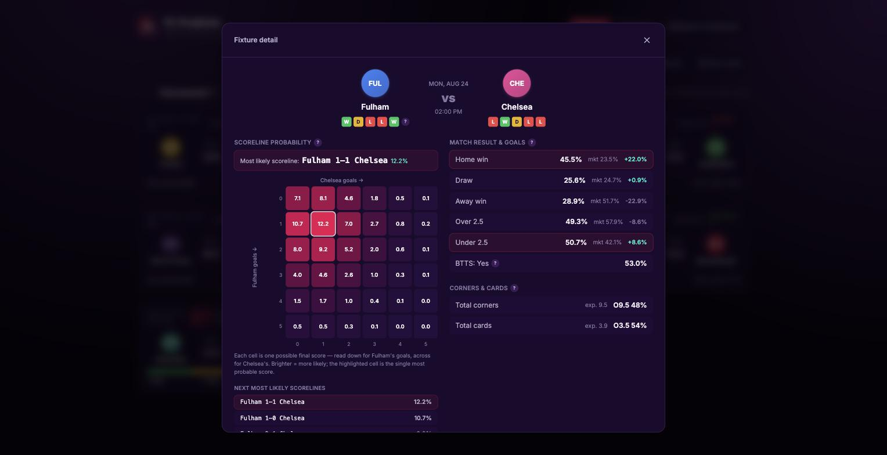
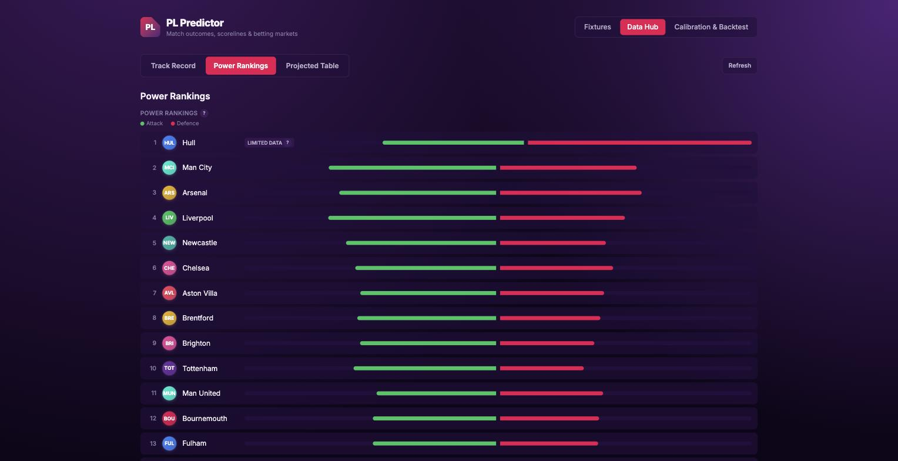
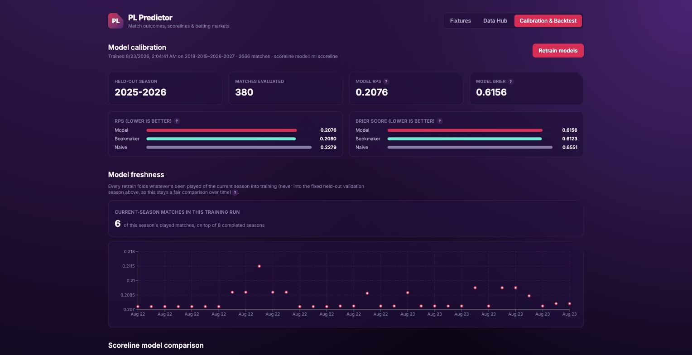

# PL Predictor

<p>
  
  
  
  
  
  
</p>

A self-hosted Premier League prediction dashboard. Match outcomes and
scorelines are the core, on top of which sit corners/cards, live value-bet
detection, and player-level goalscorer/assist predictions — all served
through a FastAPI backend and a React dashboard, with every prediction
tracked against what actually happens so the model can be judged honestly
rather than taken on faith.

**Table of contents:** [Screenshots](#screenshots) · [What it does](#what-it-does) ·
[How it's built](#how-its-built) · [Setup](#setup) · [Train the models](#train-the-models) ·
[Run the dashboard](#run-the-dashboard) · [Using it from your phone](#using-it-from-your-phone-tailscale) ·
[Notebooks](#notebooks) · [Project layout](#project-layout) · [Notes / limitations](#notes--current-limitations)

**Continuing development:** see [AI continuity and improvement log](docs/AI_CONTINUITY.md) for the current architecture, model evidence, review findings, data-source rules, and the required experiment protocol for future contributors/agents.

## Screenshots

<table>
<tr>
<td width="50%">

**Fixtures — one gameweek at a time**
<br>Completed and upcoming matches together, prev/next between gameweeks,
value-bet fixtures flagged automatically.
<br>

</td>
<td width="50%">

**Fixture detail — click through on any match**
<br>Scoreline probability heatmap, market-vs-model edges, corners/cards,
head-to-head, and likely scorers, for finished fixtures too.
<br>

</td>
</tr>
<tr>
<td width="50%">

**Data Hub — power rankings**
<br>The model's own fitted attack/defence strength per team, not a
league-table proxy.
<br>

</td>
<td width="50%">

**Calibration & backtest**
<br>Model vs. bookmaker RPS/Brier on a genuinely held-out season, plus how
much of the current season has folded into training so far.
<br>

</td>
</tr>
</table>

## What it does

- **Match outcomes & scorelines** — Dixon-Coles and Bivariate-Poisson goal
  models (via [`penaltyblog`](https://github.com/martineastwood/penaltyblog)),
  plus an Optuna-tuned XGBoost regressor; whichever has the better held-out
  RPS is served. Full scoreline probability grid, not just 1X2.
- **Corners & cards** — XGBoost count regressors on the same feature set,
  since the goal models can't derive these markets on their own.
- **Live value bets** — [The Odds API](https://the-odds-api.com/) odds are
  de-vigged (Shin's method) and compared against the model's own
  probabilities; the fixture detail surfaces at most one qualified
  match-result or goals-total single, never a parlay.
- **Player-level predictions** — anytime goalscorer/assist probabilities
  per squad, with confirmed lineups when available and primary penalty/
  set-piece takers. Goal + assist uses a direct, chronologically-calibrated
  classifier that beat the prior Poisson-union baseline; Goal and Assist keep
  their specialised rate models. Live injury/suspension status from the
  official FPL API gates every prediction.
- **Weekly-fresh current season** — the historical training set comes from
  football-data.co.uk (deep, reliable, but slow to publish new-season
  data), supplemented with the Premier League's own backend
  (`pulselive.com`) for fixtures/stats from the *current* season, so a
  result from this weekend can be training data within hours, not whenever
  a third-party CSV catches up.
- **Seasonal retraining research** — Calibration compares frozen, season-
  weighted, season-only, and consensus challengers across several retraining
  cadences. These are tracked with immutable pre-kickoff snapshots and remain
  research-only until they satisfy the documented multi-season promotion gate.
- **Honest tracking** — every prediction is snapshotted *before* kickoff
  into a local SQLite store and reconciled against results as they land.
  The Track Record and Backtest tabs report what the model actually said
  in advance, not a re-run of its current (possibly retrained) state
  against old data. The value-bet record separately shows confirmed W-L,
  final score, and the result-feed source for every settled recommendation.
- **Post-match review** — completed fixture details resolve scorers and
  assists from FPL's fixture/event feed, show actual team statistics, and
  review recorded result, totals, corners, cards, and tiered player calls.
  Historical player/corner reviews are labelled reconstructed when no true
  pre-kickoff snapshot existed.

## How it's built

| Layer | Stack |
|---|---|
| Match/scoreline models | [`penaltyblog`](https://github.com/martineastwood/penaltyblog) (Dixon-Coles, Bivariate-Poisson, Elo/Pi ratings, de-vigging) + XGBoost, tuned with [Optuna](https://optuna.org/) |
| Corners/cards/player stats | XGBoost regressors, scikit-learn |
| Backend | FastAPI, served with `uvicorn --reload` |
| Frontend | React 19 + TypeScript + Vite + Tailwind |
| Data sources | football-data.co.uk (historical), pulselive.com (fast current-season supplement), FPL API + [vaastav's archive](https://github.com/vaastav/Fantasy-Premier-League) (player data), The Odds API (live odds), football-data.org (fixtures/standings) |
| Prediction tracking | SQLite (snapshot → reconcile), local to this install |

<details>
<summary><strong>Why penaltyblog + XGBoost, not just one or the other?</strong></summary>

<br>Goals follow a Poisson-ish process well enough that a dedicated
statistical model (Dixon-Coles / Bivariate-Poisson) captures most of the
signal with far less data than a tree ensemble needs, and it comes with a
century of established match-modeling theory behind it. But corners and
cards don't fit that same generative story, and a tuned XGBoost regressor
picks up feature interactions (form, rest days, head-to-head, table
context) that a two-parameter attack/defence model can't represent at all.
Both scoreline approaches are fit and evaluated every retrain — whichever
wins on held-out RPS is what actually gets served.

</details>

## Setup

```bash
python3 -m venv .venv
source .venv/bin/activate
pip install -e . -c requirements-lock.txt

cp .env.example .env
# then add:
#   ODDS_API_KEY=...      — free key, no card, from https://the-odds-api.com/
#   FOOTBALL_DATA_KEY=... — free key, no card, from https://www.football-data.org/client/register
```

`requirements-lock.txt` pins every dependency (direct and transitive) to the
versions this project is actually developed and tested against — a plain
`pip freeze`, used as a constraints file so `pyproject.toml` stays the
readable source of direct dependencies. Regenerate it after intentionally
upgrading a package: `pip freeze --exclude-editable > requirements-lock.txt`.

`ODDS_API_KEY` powers live odds/value-bet detection; without it, predictions
still work but with no market to compare against. `FOOTBALL_DATA_KEY`
powers the current-season fixture list and gameweek grouping the Fixtures
page is built around; without it, the app falls back to the FPL API for a
plain remaining-fixtures list, but the gameweek-organized view needs it.

<details>
<summary><strong>Hit a <code>ModuleNotFoundError</code> right after <code>pip install -e .</code>?</strong></summary>

<br>Some environments silently skip pip's auto-generated
`__editable__*.pth` file (security tooling that filters that naming
pattern was the cause during development of this project). Fix: add a
normally-named `.pth` file yourself:

```bash
echo "$(pwd)/src" > .venv/lib/python3.*/site-packages/pl_predictor.pth
```

If you hit this, also set `export PYTHONPATH=$(pwd)/src` when running
scripts directly (`python -m pl_predictor...`) rather than through
pytest/Jupyter, which don't always pick up freshly-added `.pth` files
mid-session.

</details>

## Train the models

```bash
python -m pl_predictor.models.manifest
```

Fetches the last 8 completed EPL seasons from football-data.co.uk for
scoreline and cards (cached to `data/cache/` after the first run), builds
features, fits the scoreline model (Dixon-Coles vs. Bivariate-Poisson vs.
XGBoost, picks whichever has the better held-out RPS) and the corners/cards
XGBoost regressors, and writes `models/manifest.json` + the trained model
files. Corners trains on a longer 12-season window instead — a corroborated
improvement (see `docs/AI_CONTINUITY.md`'s EXP-2026-11/12) — configurable
per market via `models/manifest.py::MARKET_TRAINING_WINDOWS`.

Want to re-tune the XGBoost scoreline model's hyperparameters instead of
using the defaults already checked in? `python -m
pl_predictor.evaluate.tune_hyperparams` runs an Optuna search against
5-fold walk-forward validation (not a single held-out season, to avoid
overfitting the hyperparameters the same way a feature can overfit) and
resumes from where a previous run left off.

## Run the dashboard

Two processes: the API (backend) and the web app (frontend). In one
terminal:

```bash
source .venv/bin/activate
export PYTHONPATH=$(pwd)/src   # see the editable-install note above
uvicorn pl_predictor.api.main:app --reload --reload-dir src --host 0.0.0.0 --port 8000
```

<details>
<summary><strong>Why <code>--reload-dir src</code> specifically?</strong></summary>

<br>Without it, uvicorn's file-watcher scans the whole working directory
by default, including `.venv/` — hundreds of thousands of files. Anything
that touches the venv (a `pip install`, even incidental mtime changes)
triggers a reload storm that makes every request hang or time out until
it settles. Scoping the watch to `src/` avoids this entirely.

</details>

In a second terminal (first time only, `npm install`):

```bash
cd frontend
npm install
npm run dev
```

Open the URL Vite prints (`http://localhost:5173`). Three pages:

- **Fixtures** — one gameweek at a time (completed and upcoming matches
  together), with prev/next controls to browse other gameweeks. Every
  fixture is clickable — including already-finished ones, which show the
  honest prediction that was actually recorded before kickoff, not a
  live recompute that could leak the result back in — and opens the full
  detail view: scoreline heatmap, full market breakdown with live-odds
  edges, corners/cards, head-to-head, recent form, and likely
  goalscorers/assists per squad with live injury/suspension status. Completed
  fixtures add a prediction review showing the final score and which recorded
  match, goals, corners, cards, and qualifying player calls were correct.
- **Data Hub** — a Team Hub for current-season form, underlying performance,
  playing style, and set-piece xG share; a searchable, sortable Player Hub
  for season-to-date FPL performance; plus power rankings, a projected final
  table, and a live track record. Team/player Hub data is descriptive only and
  does not change predictions or betting recommendations.
- **Calibration & Backtest** — model vs. bookmaker RPS/Brier, corners/cards
  model metrics, how much of the current season has folded into training,
  and a value-bet backtest with a bankroll chart, plus buttons to retrain
  models or refresh fixtures/odds.

The first request for an upcoming fixture can take a few seconds while player
data is fetched and cached. Completed fixtures in the current gameweek are
warmed in the background after API startup so their reviews should open
quickly once that job finishes.

The backend also serves interactive API docs at `http://localhost:8000/docs`.

### Using it from your phone (Tailscale)

<details>
<summary><strong>Expand for phone/Tailscale setup</strong></summary>

<br>The `--host 0.0.0.0` above and `frontend/vite.config.ts`'s `host: true`
make both servers reachable from other devices, not just this machine —
but only over a network that can actually route to it.
[Tailscale](https://tailscale.com/) is the easiest way to do that from
anywhere (not just home wifi), without exposing anything to the public
internet:

1. Install Tailscale on this machine (`brew install tailscale` or the App
   Store app on macOS) and on your phone, and sign into the same account
   on both.
2. Start Tailscale on this machine (menu bar app, or `sudo tailscale up`)
   and find its Tailscale name/IP — the Tailscale app shows it, or run
   `tailscale ip`.
3. Start both servers as above.
4. On your phone, open `http://<that-tailscale-name-or-ip>:5173` in a
   browser.

</details>

## Deploying a public, read-only version

Everything above is the full app — every admin control (retrain, refresh
fixtures/odds, backtest) live, no login. It's meant to stay that way for
local/private use only; the backend has no real security beyond that
assumption (see `api/main.py`'s CORS comment).

To share a cut-down, password-gated version with other people (fixtures,
predictions, Data Hub, and a simplified model page — no admin controls, no
retrain button), the repo-root `Dockerfile` builds one image serving both
the API and the built frontend from a single origin.

**This public deployment never runs the live-serving pipeline itself** —
confirmed live that doing so (Elo/Pi replay, rolling form, xG, the whole
`FixtureFeatureContext` build) exceeds a free-tier host's memory budget and
OOM-crashes it. Instead it serves everything from a precomputed
`data/public_snapshot.json` that you generate locally (full resources, same
idea as retraining) and push:

```bash
PYTHONPATH=src python -m pl_predictor.public_snapshot
git add data/public_snapshot.json && git commit -m "Refresh public snapshot" && git push
```

Run that whenever you want the public site to reflect new results/odds —
Render's next auto-deploy picks up the new file. No live external API keys
are needed on Render itself; the snapshot already has everything baked in.

Setup:

1. Push this repo to GitHub (a new or existing repo).
2. Create a free [Render](https://render.com) account → "New Web Service" →
   connect that repo. Render auto-detects the `Dockerfile`.
3. In Render's dashboard, set these environment variables (never commit
   real values for either of these):
   - `PUBLIC_MODE=true`
   - `GUEST_PASSWORD=<pick something>` — the whole site is gated behind an
     HTTP Basic Auth prompt (any username, this password) once this is set.
4. Deploy. Render gives you a free `https://<name>.onrender.com` link —
   that's what you share, along with the guest password.

Free-tier tradeoffs worth knowing: the service sleeps after ~15 minutes of
no traffic (next visit takes ~30-60s to wake up), and data only updates
when you regenerate and push the snapshot — this is a deliberate tradeoff
for staying on a free host, not a bug.

Leaving `PUBLIC_MODE` unset (the default everywhere else, including
locally) reproduces every current behavior exactly — no password prompt,
every admin button/endpoint active, live computation as always.

## Notebooks

Numbered `notebooks/01`–`07` walk through data exploration → feature
engineering → the scoreline model → corners/cards models → backtest/
calibration → live predictions → evidence research. Each one only calls functions from the
`pl_predictor` package — never redefines logic inline — so they can't
drift out of sync with what's actually trained/served. Open them in
VSCode's Jupyter extension, or `jupyter lab`.

## Project layout

```
src/pl_predictor/
├── data/            historical match/player data, live odds/FPL/pulselive/football-data.org APIs
├── features/        rolling team/player form, Elo/Pi ratings, h2h, rest days, cold-start, table context
├── models/          scoreline (Dixon-Coles/Bivariate-Poisson/XGBoost), corners/cards, player goals, manifest
├── evaluate/        calibration (RPS/Brier vs. bookmaker), backtest, walk-forward validation, Optuna tuning,
│                    player/seasonal/power-ranking research and betting validation
├── odds/            de-vig live odds, surface value bets
├── tracking/        SQLite-backed live prediction track record (snapshot → reconcile)
└── api/             FastAPI app — thin JSON layer over everything above
frontend/            React + TypeScript + Vite + Tailwind dashboard
notebooks/           01-07, see above
tests/               feature-leakage and no-lookahead checks (pytest)
```

## Notes / current limitations

<details>
<summary><strong>Newly-promoted teams</strong></summary>

<br>The goal model can only score teams it saw at fit time. A team with
zero history in the loaded seasons window (e.g. a club promoted for the
first time in years) falls back to a league-average-strength prediction —
flagged as `is_fallback_prediction` / `New-team fallback` in the app and
notebooks — rather than crashing. This is a known approximation, not a
solved problem: it doesn't yet use Championship form to estimate a
newly-promoted team's actual strength.

</details>

<details>
<summary><strong>BTTS/corners/cards have no live market</strong></summary>

<br>The Odds API's bulk `/odds` endpoint only serves "core" markets — 1X2
(`h2h`) and totals. BTTS, corners, and cards are "additional markets" only
available per-event via a different endpoint (not implemented here), so
those three stay model-only predictions with no live edge to compare
against.

</details>

<details>
<summary><strong>Backtest is a sanity check, not a strategy</strong></summary>

<br>A strongly positive ROI on one held-out season is far more likely to
mean overfitting/leakage than a genuine edge. Expect roughly break-even to
slightly negative — that's the healthy outcome, not a bug.

The app never recommends a parlay: standalone market edges do not provide a
joint probability or the bookmaker-specific price required to assess a
multi-leg bet. Player, corners, and cards outputs remain model projections,
not live-odds recommendations.

</details>

<details>
<summary><strong>Player predictions have a live-status lag</strong></summary>

<br>Injured/suspended/doubtful players are correctly zeroed/discounted using
the official FPL API's live `status` and `chance_of_playing_next_round` — but
a recent change may not be reflected instantly. When ESPN publishes a
confirmed starting eleven, the player surface switches to it; otherwise it
uses the start model. Only confirmed starters are snapshotted for the player
review, so a late lineup change can still invalidate an earlier projection.

</details>

<details>
<summary><strong>Snapshot provenance matters</strong></summary>

<br>Core predictions and qualified live value-bet calls are captured before
kickoff into `data/tracking.db` (gitignored — it is local personal history),
then reconciled once results arrive. Older core rows may be clearly marked
backfilled. Player and corners/cards reviews can be reconstructed from saved
inputs after a match to keep the archive useful, but these rows remain
labelled reconstructed and are never proof of prospective accuracy or
profitability.

</details>

<details>
<summary><strong><code>pulselive.com</code> is an undocumented endpoint</strong></summary>

<br>It's the Premier League's own site backend, reachable with no API key
and no published terms for programmatic use — used here only as a private,
non-redistributed supplement to close the freshness gap in
football-data.co.uk's publishing schedule (fixtures and match stats for
the *current* season only; all historical training data still comes from
football-data.co.uk). If that trade-off doesn't sit right with you, it's
isolated to `data/pulselive.py` / `data/football_data.py`'s fallback path
and can be disabled without touching anything else.

</details>
