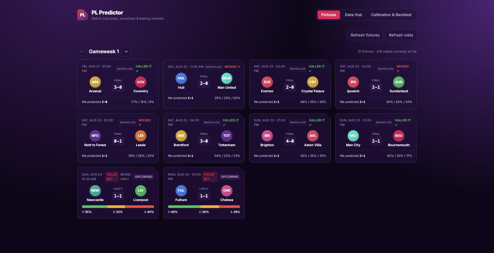
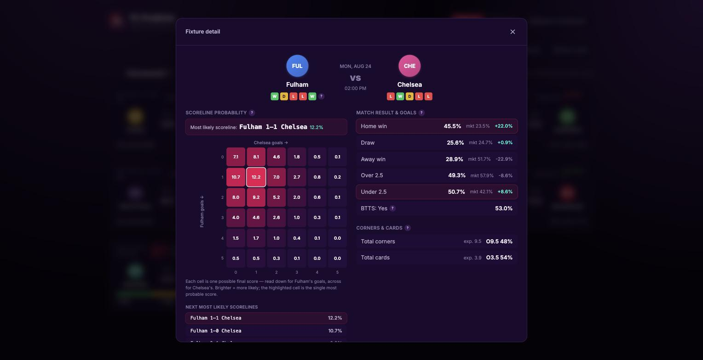
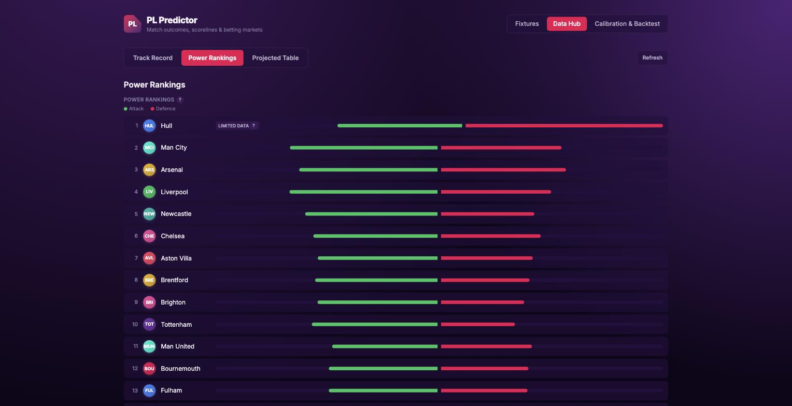
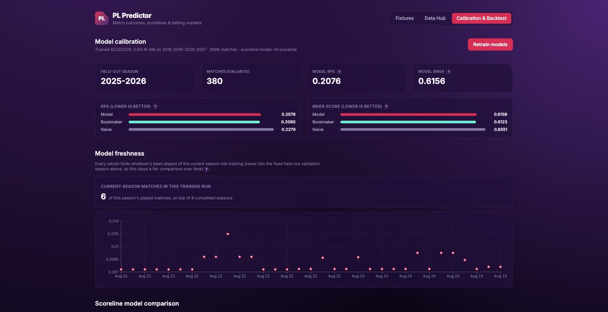

# PL Predictor

<p>
  
  
  
  
  
  
</p>

A self-hosted Premier League prediction dashboard. Match outcomes and
scorelines are the core, on top of which sit corners/cards, live value-bet
detection, and player-level goalscorer/assist predictions — all served
through a FastAPI backend and a React dashboard, with every prediction
tracked against what actually happens so the model can be judged honestly
rather than taken on faith.

**Table of contents:** [Screenshots](#screenshots) · [What it does](#what-it-does) ·
[How it's built](#how-its-built) · [Setup](#setup) · [Train the models](#train-the-models) ·
[Run the dashboard](#run-the-dashboard) · [Using it from your phone](#using-it-from-your-phone-tailscale) ·
[Notebooks](#notebooks) · [Project layout](#project-layout) · [Notes / limitations](#notes--current-limitations)

**Continuing development:** see [AI continuity and improvement log](docs/AI_CONTINUITY.md) for the current architecture, model evidence, review findings, data-source rules, and the required experiment protocol for future contributors/agents.

## Screenshots

<table>
<tr>
<td width="50%">

**Fixtures — one gameweek at a time**
<br>Completed and upcoming matches together, prev/next between gameweeks,
value-bet fixtures flagged automatically.
<br>

</td>
<td width="50%">

**Fixture detail — click through on any match**
<br>Scoreline probability heatmap, market-vs-model edges, corners/cards,
head-to-head, and likely scorers, for finished fixtures too.
<br>

</td>
</tr>
<tr>
<td width="50%">

**Data Hub — power rankings**
<br>The model's own fitted attack/defence strength per team, not a
league-table proxy.
<br>

</td>
<td width="50%">

**Calibration & backtest**
<br>Model vs. bookmaker RPS/Brier on a genuinely held-out season, plus how
much of the current season has folded into training so far.
<br>

</td>
</tr>
</table>

## What it does

- **Match outcomes & scorelines** — Dixon-Coles and Bivariate-Poisson goal
  models (via [`penaltyblog`](https://github.com/martineastwood/penaltyblog)),
  plus an Optuna-tuned XGBoost regressor; whichever has the better held-out
  RPS is served. Full scoreline probability grid, not just 1X2.
- **Corners & cards** — XGBoost count regressors on the same feature set,
  since the goal models can't derive these markets on their own.
- **Live value bets** — [The Odds API](https://the-odds-api.com/) odds are
  de-vigged (Shin's method) and compared against the model's own
  probabilities; the fixture detail surfaces at most one qualified
  match-result or goals-total single, never a parlay.
- **Player-level predictions** — anytime goalscorer/assist probabilities
  per squad, with confirmed lineups when available and primary penalty/
  set-piece takers. Goal + assist uses a direct, chronologically-calibrated
  classifier that beat the prior Poisson-union baseline; Goal and Assist keep
  their specialised rate models. Live injury/suspension status from the
  official FPL API gates every prediction.
- **Weekly-fresh current season** — the historical training set comes from
  football-data.co.uk (deep, reliable, but slow to publish new-season
  data), supplemented with the Premier League's own backend
  (`pulselive.com`) for fixtures/stats from the *current* season, so a
  result from this weekend can be training data within hours, not whenever
  a third-party CSV catches up.
- **Seasonal retraining research** — Calibration compares frozen, season-
  weighted, season-only, and consensus challengers across several retraining
  cadences. These are tracked with immutable pre-kickoff snapshots and remain
  research-only until they satisfy the documented multi-season promotion gate.
- **Honest tracking** — every prediction is snapshotted *before* kickoff
  into a local SQLite store and reconciled against results as they land.
  The Track Record and Backtest tabs report what the model actually said
  in advance, not a re-run of its current (possibly retrained) state
  against old data. The value-bet record separately shows confirmed W-L,
  final score, and the result-feed source for every settled recommendation.
- **Post-match review** — completed fixture details resolve scorers and
  assists from FPL's fixture/event feed, show actual team statistics, and
  review recorded result, totals, corners, cards, and tiered player calls.
  Historical player/corner reviews are labelled reconstructed when no true
  pre-kickoff snapshot existed.
- **Squad continuity** — a leading indicator of off-season squad-strength
  change: what fraction of a team's playing time last season is still on
  the books this season. Feeds the scoreline model directly and is shown
  per-team on the Calibration page, so a squad overhaul is visible to the
  model *before* it's had to be proven by results.
- **FPL tab** — a free-data Fantasy Premier League companion: a player
  scout with position/price/minutes filters, a legal-XI optimiser with
  selectable formations, a full 15-player squad optimiser, and transfer
  planning from either a public FPL entry ID or a manually entered squad.
  Built on a transparent pre-deadline baseline (no historical player-points
  model has beaten it yet), not treated as a validated prediction.

## How it's built

| Layer | Stack |
|---|---|
| Match/scoreline models | [`penaltyblog`](https://github.com/martineastwood/penaltyblog) (Dixon-Coles, Bivariate-Poisson, Elo/Pi ratings, de-vigging) + XGBoost, tuned with [Optuna](https://optuna.org/) |
| Corners/cards/player stats | XGBoost regressors, scikit-learn |
| Backend | FastAPI, served with `uvicorn --reload` |
| Frontend | React 19 + TypeScript + Vite + Tailwind |
| Data sources | football-data.co.uk (historical), pulselive.com (fast current-season supplement), FPL API + [vaastav's archive](https://github.com/vaastav/Fantasy-Premier-League) (player data), The Odds API (live odds), football-data.org (fixtures/standings) |
| Prediction tracking | SQLite (snapshot → reconcile), local to this install |

<details>
<summary><strong>Why penaltyblog + XGBoost, not just one or the other?</strong></summary>

<br>Goals follow a Poisson-ish process well enough that a dedicated
statistical model (Dixon-Coles / Bivariate-Poisson) captures most of the
signal with far less data than a tree ensemble needs, and it comes with a
century of established match-modeling theory behind it. But corners and
cards don't fit that same generative story, and a tuned XGBoost regressor
picks up feature interactions (form, rest days, head-to-head, table
context) that a two-parameter attack/defence model can't represent at all.
Both scoreline approaches are fit and evaluated every retrain — whichever
wins on held-out RPS is what actually gets served.

</details>

## Setup

```bash
python3 -m venv .venv
source .venv/bin/activate
pip install -e . -c requirements-lock.txt

cp .env.example .env
# then add:
#   ODDS_API_KEY=...      — free key, no card, from https://the-odds-api.com/
#   FOOTBALL_DATA_KEY=... — free key, no card, from https://www.football-data.org/client/register
```

`requirements-lock.txt` pins every dependency (direct and transitive) to the
versions this project is actually developed and tested against — a plain
`pip freeze`, used as a constraints file so `pyproject.toml` stays the
readable source of direct dependencies. Regenerate it after intentionally
upgrading a package: `pip freeze --exclude-editable > requirements-lock.txt`.

`ODDS_API_KEY` powers live odds/value-bet detection; without it, predictions
still work but with no market to compare against. `FOOTBALL_DATA_KEY`
powers the current-season fixture list and gameweek grouping the Fixtures
page is built around; without it, the app falls back to the FPL API for a
plain remaining-fixtures list, but the gameweek-organized view needs it.

<details>
<summary><strong>Hit a <code>ModuleNotFoundError</code> right after <code>pip install -e .</code>?</strong></summary>

<br>Some environments silently skip pip's auto-generated
`__editable__*.pth` file (security tooling that filters that naming
pattern was the cause during development of this project). Fix: add a
normally-named `.pth` file yourself:

```bash
echo "$(pwd)/src" > .venv/lib/python3.*/site-packages/pl_predictor.pth
```

If you hit this, also set `export PYTHONPATH=$(pwd)/src` when running
scripts directly (`python -m pl_predictor...`) rather than through
pytest/Jupyter, which don't always pick up freshly-added `.pth` files
mid-session.

</details>

## Train the models

```bash
python -m pl_predictor.models.manifest
```

Fetches the last 8 completed EPL seasons from football-data.co.uk for
scoreline and cards (cached to `data/cache/` after the first run), builds
features, fits the scoreline model (Dixon-Coles vs. Bivariate-Poisson vs.
XGBoost, picks whichever has the better held-out RPS) and the corners/cards
XGBoost regressors, and writes `models/manifest.json` + the trained model
files. Corners trains on a longer 12-season window instead — a corroborated
improvement (see `docs/AI_CONTINUITY.md`'s EXP-2026-11/12) — configurable
per market via `models/manifest.py::MARKET_TRAINING_WINDOWS`.

Want to re-tune the XGBoost scoreline model's hyperparameters instead of
using the defaults already checked in? `python -m
pl_predictor.evaluate.tune_hyperparams` runs an Optuna search against
5-fold walk-forward validation (not a single held-out season, to avoid
overfitting the hyperparameters the same way a feature can overfit) and
resumes from where a previous run left off.

## The test gate

## The test gate

### Which workflow runs the tests (read this first)

**`.github/workflows/tests.yml` ("tests") runs the suite on every push to
`main` and every pull request. It is advisory: `main` has no branch protection
and no rulesets, so nothing about a red `tests` run blocks a merge.**

That is a decision, not an accident, and the reason is in the next section.
The test that says so is `tests/test_tests_workflow.py`; it is not enforced
from the workflow file, because "is this a required status check" is a fact
about the server rather than about the repository, and nothing in the tree can
see it.

**Check it yourself in one command**, rather than trusting the paragraph above:

```bash
gh workflow list --repo Kevocado/PL_Predictor

# the last few runs of the gate, and what each concluded
gh api "repos/Kevocado/PL_Predictor/actions/workflows/tests.yml/runs?per_page=5" \
  --jq '.workflow_runs[] | {id, event, conclusion, created_at}'

# whether `main` is actually protected, and whether `tests` is required.
# 404 / "Branch not protected"  -> advisory, which is what this section claims.
# `[]`                          -> no rulesets either.
gh api repos/Kevocado/PL_Predictor/branches/main/protection
gh api repos/Kevocado/PL_Predictor/rulesets
```

(The deploy section above lists its runs with a different `gh` subcommand.
`test_deploy_workflow.py` mutates that one to prove its own README guard can
fail, and the mutation is only meaningful while the string it anchors on appears
exactly once in this file — which it enforced, correctly, the first time this
section duplicated it.)

### The suite needs the network, and that is why the gate is advisory

`data/cache/` is **gitignored** — only `.gitkeep` is tracked — so a fresh
clone has no FPL player-gameweek archive, no ClubElo ratings and no
football-data.co.uk CSVs. 20 of the tests read that data.

Measured on this machine, 2026-09-28, against `origin/main` at `4975f22`
(540 tests then; the suite has grown since, and the 20 are the same ones):

| | wall | result |
|---|---|---|
| warm cache, network blocked | **669.66s** (11m09s) | 513 passed, 27 skipped |
| cold cache, network blocked | 148.21s (2m28s) | **20 failed**, 493 passed — fast and legible |
| cold cache, network allowed | 4926.07s (1h22m) | fills the cache: 4,723 files, 87MB |

The middle row is the design working, not a problem: `tests/conftest.py` blocks
outbound connections, so a test that wants data it does not have fails in
seconds and names the command that warms it, instead of spending twelve
minutes being paced by a third party's rate limit.

`tests.yml` handles this in two jobs rather than one. A **warm-cache** job runs
first with `PL_ALLOW_NETWORK=1` to populate the cache, and the **gate** job
then runs the same tests with the network blocked. That split is the point: if
one step did both, a test that reached the network would pass and the guard
would be checking nothing on a run that looked green -- and one job would mean
one timeout for two costs that differ by an order of magnitude. The warm step
is skipped entirely when a cache was restored, so a CI runner is a cold clone
on its *first* run, not on every one.

The consequence is the thing worth knowing. Because the suite reads FPL,
ClubElo and football-data.co.uk, **an upstream outage can still turn the gate
red for a reason that has nothing to do with the change under review** — if the
warm step cannot reach an upstream, the gating step has no cache to read. That
is the whole argument against making it a required check. A required check
that intermittently goes red for reasons outside the diff is a check people
learn to re-run rather than read.

### One test is marked `network`

`tests/test_current_season_check.py::test_evaluate_count_market_arms_on_current_season_flags_low_power`
is the only test that needs the per-match understat shot archive — 4,649
files, one HTTP request per match, with a 0.3s delay between uncached ones.
Marking it `@pytest.mark.network` is what stops the warm step paying for it
(70 of that 82 minutes), and it is also what makes `-m "not network"` select
something: before this was marked the split deselected nothing and ran the whole
suite on both halves. The marker is registered in `pyproject.toml`.

### Two things about the gate that will surprise you

- **The suite dirties tracked files.** It rewrites four `models/*.json`
  (XGBoost models) on every run. A `git diff --exit-code` step added to
  `tests.yml` would fail on an untouched tree.
- **The two timeouts are set by two measurements, not by feel.** The warm job
  carries 150 minutes against the 4926.07s cold run; the gate job carries 30
  against the 1336s (22m16s) the gate half measured on the CI runner. A
  timeout below the cost it covers is not a safety improvement: the job is
  killed before `actions/cache`'s post step runs, so it saves no cache, so
  the next run is cold too. This file shipped the warm at 60 against a
  4926.07s cold run -- 3600s, below the very cost it was commenting on -- and
  the gate at 20 against a 1336s gate, the same bug in miniature.
  `tests/test_tests_workflow.py` holds each setting to the duration its
  comment claims, so neither can drift alone.


## Run the dashboard

One command starts both the API and the web app (Ctrl+C stops both):

```bash
./scripts/dev.sh
```

Open the URL Vite prints (`http://localhost:5173`) — same as the manual
two-terminal setup below, which `dev.sh` just automates.

<details>
<summary><strong>Or run the two processes manually</strong></summary>

<br>Two processes: the API (backend) and the web app (frontend). In one
terminal:

```bash
source .venv/bin/activate
export PYTHONPATH=$(pwd)/src   # see the editable-install note above
uvicorn pl_predictor.api.main:app --reload --reload-dir src --host 0.0.0.0 --port 8000
```

<details>
<summary><strong>Why <code>--reload-dir src</code> specifically?</strong></summary>

<br>Without it, uvicorn's file-watcher scans the whole working directory
by default, including `.venv/` — hundreds of thousands of files. Anything
that touches the venv (a `pip install`, even incidental mtime changes)
triggers a reload storm that makes every request hang or time out until
it settles. Scoping the watch to `src/` avoids this entirely.

</details>

In a second terminal (first time only, `npm install`):

```bash
cd frontend
npm install
npm run dev
```

</details>

Three pages:

- **Fixtures** — one gameweek at a time (completed and upcoming matches
  together), with prev/next controls to browse other gameweeks. Every
  fixture is clickable — including already-finished ones, which show the
  honest prediction that was actually recorded before kickoff, not a
  live recompute that could leak the result back in — and opens the full
  detail view: scoreline heatmap, full market breakdown with live-odds
  edges, corners/cards, head-to-head, recent form, and likely
  goalscorers/assists per squad with live injury/suspension status. Completed
  fixtures add a prediction review showing the final score and which recorded
  match, goals, corners, cards, and qualifying player calls were correct.
- **Data Hub** — a Team Hub for current-season form, underlying performance,
  playing style, and set-piece xG share; a searchable, sortable Player Hub
  for season-to-date FPL performance; plus power rankings, a projected final
  table, and a live track record. Team/player Hub data is descriptive only and
  does not change predictions or betting recommendations.
- **Calibration & Backtest** — model vs. bookmaker RPS/Brier, corners/cards
  model metrics, how much of the current season has folded into training,
  and a value-bet backtest with a bankroll chart, plus buttons to retrain
  models or refresh fixtures/odds.

The first request for an upcoming fixture can take a few seconds while player
data is fetched and cached. Completed fixtures in the current gameweek are
warmed in the background after API startup so their reviews should open
quickly once that job finishes.

The backend also serves interactive API docs at `http://localhost:8000/docs`.

### Using it from your phone (Tailscale)

<details>
<summary><strong>Expand for phone/Tailscale setup</strong></summary>

<br>The `--host 0.0.0.0` above and `frontend/vite.config.ts`'s `host: true`
make both servers reachable from other devices, not just this machine —
but only over a network that can actually route to it.
[Tailscale](https://tailscale.com/) is the easiest way to do that from
anywhere (not just home wifi), without exposing anything to the public
internet:

1. Install Tailscale on this machine (`brew install tailscale` or the App
   Store app on macOS) and on your phone, and sign into the same account
   on both.
2. Start Tailscale on this machine (menu bar app, or `sudo tailscale up`)
   and find its Tailscale name/IP — the Tailscale app shows it, or run
   `tailscale ip`.
3. Start both servers as above.
4. On your phone, open `http://<that-tailscale-name-or-ip>:5173` in a
   browser.

</details>

## Deploying a public, read-only version

### Which workflow actually deploys (read this first)

**`.github/workflows/deploy.yml` ("Deploy PL Predictor") is the authoritative
deploy path. `.github/workflows/deploy-azure.yml` is legacy and does not
deploy anything on its own.**

This is worth stating up front because the two files look interchangeable and
an earlier version of this section got it wrong, which is how a reader ends up
believing Azure is the live path. What each one actually does:

| | `deploy.yml` — **live** | `deploy-azure.yml` — **legacy** |
|---|---|---|
| Runs on | **push to `main`** (paths-filtered) + `workflow_dispatch` | `workflow_dispatch` only — never on a push or PR |
| Deploys to | **the VPS**, via `ssh … deploy pl ${{ github.sha }}` | Azure Container Apps `pl-predictor` (cut over) |

`deploy.yml` has three jobs: `build` (push the image to GHCR), `vps` (the real
deploy, gated on `vars.VPS_HOST != ''`), and a `deploy-azure` job carried over
from the old workflow that is gated on `vars.DEPLOY_AZURE == 'true'` and
therefore reports as `skipped` — that Azure job is a leftover, not the deploy
path. `tests/test_deploy_workflow.py` pins all of this, including the gates.

**How to check this yourself in one command**, rather than trusting this table
or the file names:

```bash
gh workflow list --repo Kevocado/PL_Predictor
gh run list  --repo Kevocado/PL_Predictor --workflow deploy.yml -L 5
gh run view <id> --repo Kevocado/PL_Predictor --json jobs \
  --jq '.jobs[] | {name, conclusion}'
```

The run whose `conclusion` is `success` with a `Deploy to the VPS` job at
`success` is what production is actually serving. Note that `deploy.yml` uses
a **paths whitelist**, so `main` can be ahead of what is deployed: a commit that
only touches `tests/` or `data/` deploys nothing, and production stays on the
last sha that changed one of `src/`, `frontend/`, `models/`, `Dockerfile`,
`pyproject.toml`, `requirements-lock.txt`, `.dockerignore`, or `deploy.yml`
itself. Do not conclude from "main is at X" that X is deployed.

The rest of this section describes the app's public-mode design, which applies
to whichever host runs it. The step-by-step below is the original Render setup
and is kept for reference; it is **not** the current deploy path.

Everything above is the full app — every admin control (retrain, refresh
fixtures/odds, backtest) live, no login. It's meant to stay that way for
local/private use only; the backend has no real security beyond that
assumption (see `api/main.py`'s CORS comment).

To share a cut-down, public version with other people (fixtures,
predictions, Data Hub, and a simplified model page — no admin controls, no
retrain button, no login), the repo-root `Dockerfile` builds one image
serving both the API and the built frontend from a single origin.

**This public deployment never runs the live-serving pipeline itself** —
confirmed live that doing so (Elo/Pi replay, rolling form, xG, the whole
`FixtureFeatureContext` build) exceeds a free-tier host's memory budget and
OOM-crashes it. Instead it serves everything from a precomputed
`data/public_snapshot.json` that you generate locally (full resources, same
idea as retraining) and push:

```bash
PYTHONPATH=src python -m pl_predictor.public_snapshot
git add data/public_snapshot.json && git commit -m "Refresh public snapshot" && git push
```

Run that whenever you want the public site to reflect new results/odds — a
running process picks up the new file itself (`api/routes.py`'s
`refresh_public_snapshot_from_remote`, polled every `PUBLIC_SNAPSHOT_POLL_
SECONDS`, default 5 minutes, from `PUBLIC_SNAPSHOT_REFRESH_URL`'s raw
GitHub URL) rather than needing Render to rebuild and restart the whole
container for a pure data change — `.github/workflows/refresh-public-
snapshot.yml` runs this on a schedule so it happens without you at the
keyboard. No live external API keys are needed on Render itself; the
snapshot already has everything baked in.

Setup (the original Render setup — historical, not the current deploy path):

1. Push this repo to GitHub (a new or existing repo).
2. Create a free [Render](https://render.com) account → "New Web Service" →
   connect that repo. Render auto-detects the `Dockerfile`.
3. In Render's dashboard, set `PUBLIC_MODE=true`.
4. Still in Render's dashboard, add `data/public_snapshot.json` to
   Settings → Build & Deploy → Build Filters → Ignored Paths, so a
   snapshot-only commit doesn't also trigger a full rebuild+redeploy on
   top of the in-process refresh above (there's no Render API for this
   setting at the time this was written — it's dashboard-only).
5. Deploy. Render gives you a free `https://<name>.onrender.com` link —
   that's what you share. No password: it's read-only with no admin
   surface reachable at all, so there's nothing a login would protect.

Free-tier tradeoffs worth knowing: the service sleeps after ~15 minutes of
no traffic (next visit takes ~30-60s to wake up), and data only updates
when you regenerate and push the snapshot — this is a deliberate tradeoff
for staying on a free host, not a bug.

Leaving `PUBLIC_MODE` unset (the default everywhere else, including
locally) reproduces every current behavior exactly — every admin
button/endpoint active, live computation as always.

> **Note:** this section (and the `refresh-public-snapshot.yml` comments)
> still describes the original Render setup, and the numbered steps above are
> that setup. It is kept because the public-mode design it describes —
> `PUBLIC_MODE=true`, no live API keys on the host, the snapshot-poll
> mechanism — is what every host actually does, whatever hosts it.
>
> An earlier version of this note was wrong in every clause: it named the live
> host as Azure rather than the VPS, named the legacy file `deploy-azure.yml`
> as the deploy path rather than `deploy.yml`, and described a trigger no
> workflow in this repo has. `deploy.yml` filters with a paths **whitelist**, so
> the opposite holds — a change to `tests/` or `data/` deploys nothing. That is
> exactly the kind of error that makes a reader edit the wrong file, so it is
> pinned by `test_readme_points_at_the_deploy_workflow_that_runs`.

**Public "Refresh odds" button:** any visitor can trigger an odds/value-bet
refresh from the Fixtures page — it never runs the live pipeline on the
public host itself (same OOM concern as above); it asks GitHub Actions to
run `refresh-public-snapshot.yml` right away instead of waiting for its
next scheduled slot, then the existing snapshot-poll picks it up once that
workflow finishes and pushes (typically a few minutes). It's rate-limited
to one trigger per `PUBLIC_REFRESH_COOLDOWN_SECONDS` (default 300s) across
all visitors. Requires a `GITHUB_ACTIONS_TOKEN` secret with `actions:write`
on this repo — a fine-grained PAT scoped to just this repo's Actions is
enough, no need for a classic all-repos token. Without it, the button
returns a clear "not configured yet" error instead of failing silently.

## Notebooks

Numbered `notebooks/01`–`07` walk through data exploration → feature
engineering → the scoreline model → corners/cards models → backtest/
calibration → live predictions → evidence research. Each one only calls functions from the
`pl_predictor` package — never redefines logic inline — so they can't
drift out of sync with what's actually trained/served. Open them in
VSCode's Jupyter extension, or `jupyter lab`.

## Project layout

```
src/pl_predictor/
├── data/            historical match/player data, live odds/FPL/pulselive/football-data.org APIs
├── features/        rolling team/player form, Elo/Pi ratings, h2h, rest days, cold-start, table context
├── models/          scoreline (Dixon-Coles/Bivariate-Poisson/XGBoost), corners/cards, player goals, manifest
├── evaluate/        calibration (RPS/Brier vs. bookmaker), backtest, walk-forward validation, Optuna tuning,
│                    player/seasonal/power-ranking research and betting validation
├── odds/            de-vig live odds, surface value bets
├── tracking/        SQLite-backed live prediction track record (snapshot → reconcile)
└── api/             FastAPI app — thin JSON layer over everything above
frontend/            React + TypeScript + Vite + Tailwind dashboard
notebooks/           01-07, see above
tests/               feature-leakage and no-lookahead checks (pytest)
```

## Notes / current limitations

<details>
<summary><strong>Newly-promoted teams</strong></summary>

<br>The goal model can only score teams it saw at fit time. A team with
zero history in the loaded seasons window (e.g. a club promoted for the
first time in years) falls back to a league-average-strength prediction —
flagged as `is_fallback_prediction` / `New-team fallback` in the app and
notebooks — rather than crashing. This is a known approximation, not a
solved problem: it doesn't yet use Championship form to estimate a
newly-promoted team's actual strength.

</details>

<details>
<summary><strong>BTTS/corners/cards have no live market</strong></summary>

<br>The Odds API's bulk `/odds` endpoint only serves "core" markets — 1X2
(`h2h`) and totals. BTTS, corners, and cards are "additional markets" only
available per-event via a different endpoint (not implemented here), so
those three stay model-only predictions with no live edge to compare
against.

</details>

<details>
<summary><strong>Backtest is a sanity check, not a strategy</strong></summary>

<br>A strongly positive ROI on one held-out season is far more likely to
mean overfitting/leakage than a genuine edge. Expect roughly break-even to
slightly negative — that's the healthy outcome, not a bug.

The app never recommends a parlay: standalone market edges do not provide a
joint probability or the bookmaker-specific price required to assess a
multi-leg bet. Player, corners, and cards outputs remain model projections,
not live-odds recommendations.

</details>

<details>
<summary><strong>Player predictions have a live-status lag</strong></summary>

<br>Injured/suspended/doubtful players are correctly zeroed/discounted using
the official FPL API's live `status` and `chance_of_playing_next_round` — but
a recent change may not be reflected instantly. When ESPN publishes a
confirmed starting eleven, the player surface switches to it; otherwise it
uses the start model. Only confirmed starters are snapshotted for the player
review, so a late lineup change can still invalidate an earlier projection.

</details>

<details>
<summary><strong>Snapshot provenance matters</strong></summary>

<br>Core predictions and qualified live value-bet calls are captured before
kickoff into `data/tracking.db` (gitignored — it is local personal history),
then reconciled once results arrive. Older core rows may be clearly marked
backfilled. Player and corners/cards reviews can be reconstructed from saved
inputs after a match to keep the archive useful, but these rows remain
labelled reconstructed and are never proof of prospective accuracy or
profitability.

</details>

<details>
<summary><strong><code>pulselive.com</code> is an undocumented endpoint</strong></summary>

<br>It's the Premier League's own site backend, reachable with no API key
and no published terms for programmatic use — used here only as a private,
non-redistributed supplement to close the freshness gap in
football-data.co.uk's publishing schedule (fixtures and match stats for
the *current* season only; all historical training data still comes from
football-data.co.uk). If that trade-off doesn't sit right with you, it's
isolated to `data/pulselive.py` / `data/football_data.py`'s fallback path
and can be disabled without touching anything else.

</details>
